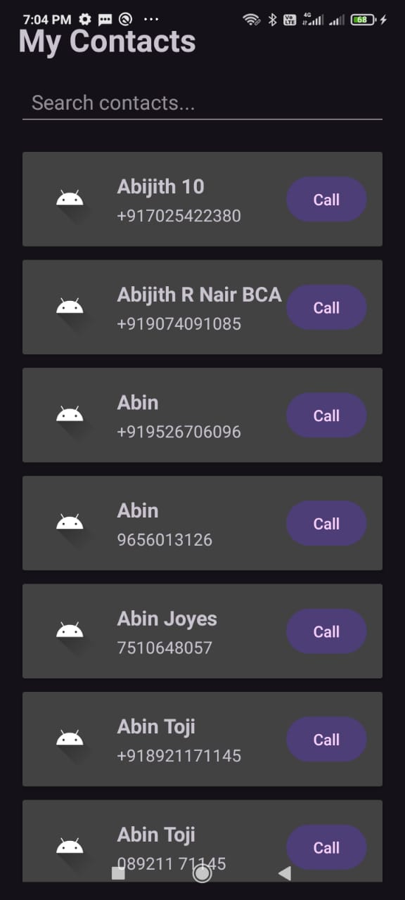
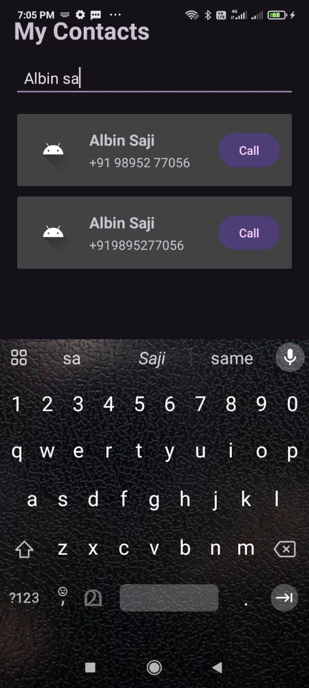
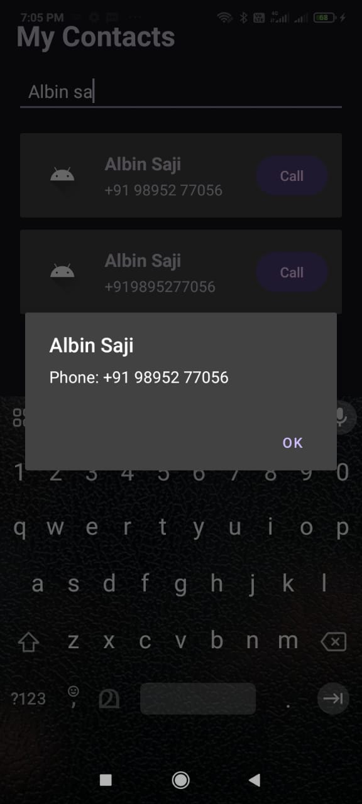
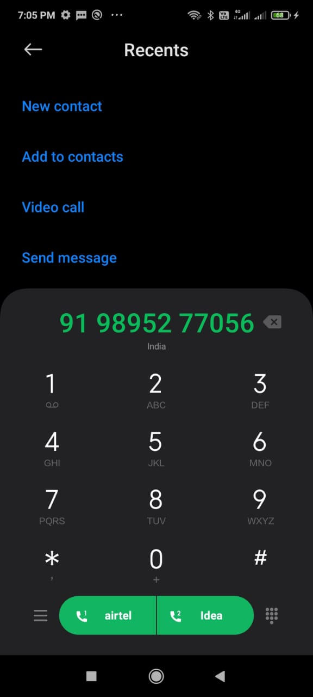

# 📱 Contact List Android App

A responsive Android Contact List application developed using **Kotlin** and **AndroidX**.

The application demonstrates RecyclerView, custom adapters, contact search and filtering, fast scrolling, runtime contact permissions, device contact access, contact details, and phone dialing.

---
## 📥 Download APK

Download and install the latest release:

👉 [Download ContactList v1.0.0](https://github.com/Alby2442/ContactList/releases/tag/v1.0.0)

> Note: Android may ask you to allow installation from unknown sources when installing the APK.

## ✨ Features

- 📋 Display contacts using RecyclerView
- 👤 Contact name, phone number, and avatar
- 🔍 Search contacts by name or phone number
- ⚡ Fast scrolling
- 👀 View contact details
- 📞 Direct phone dialing
- 🔐 Runtime contact permission handling
- 📱 Load contacts from the device
- 📐 Responsive user interface

---

## 📸 Screenshots

### 🏠 Home Screen



### 🔍 Search Contacts



### 👤 Contact Details



### 📞 Call



---

## 🛠️ Technologies Used

- Kotlin
- Android Studio
- Android SDK
- AndroidX
- RecyclerView
- RecyclerView Adapter
- FastScrollRecyclerView
- Material Components
- XML Layouts
- Gradle
- Git & GitHub

---

## 📚 Android Concepts Demonstrated

- Activity lifecycle
- RecyclerView
- ViewHolder pattern
- Custom Adapter
- Kotlin data classes
- XML layouts
- TextWatcher
- Search and filtering
- Runtime permissions
- ContentResolver
- ContactsContract
- Android Intents
- Phone dialing
- Fast scrolling

---

## 🔐 Permissions

The application requests:

```text
android.permission.READ_CONTACTS
